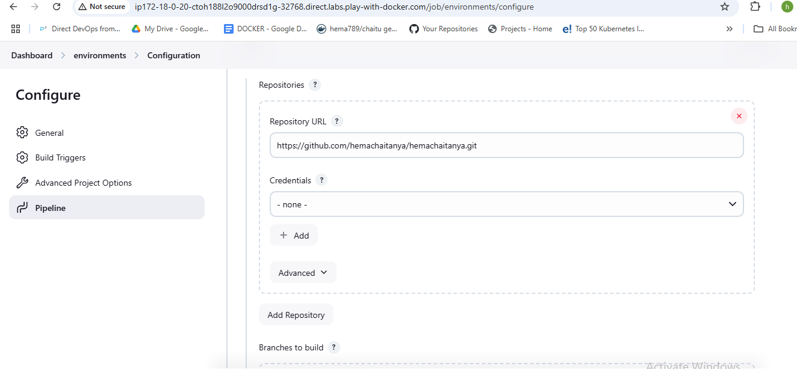
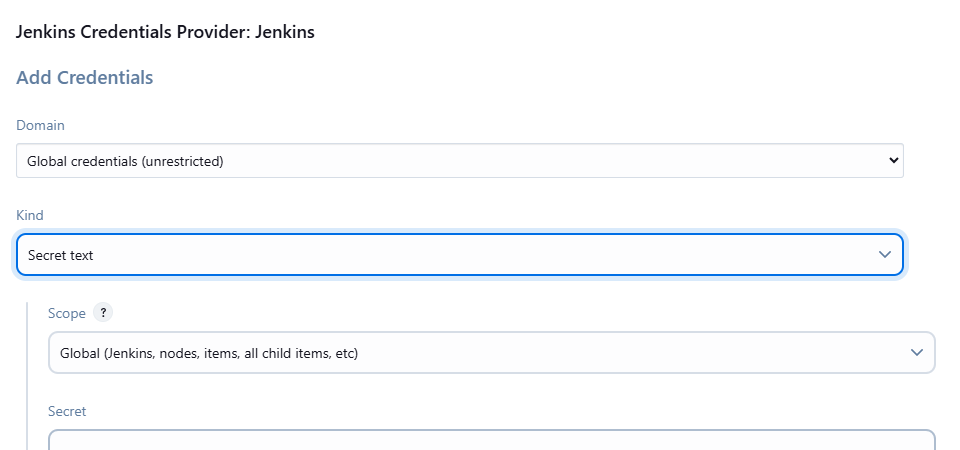
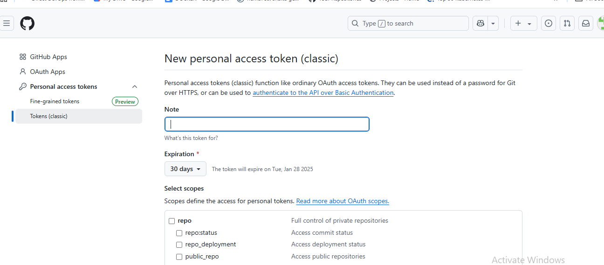
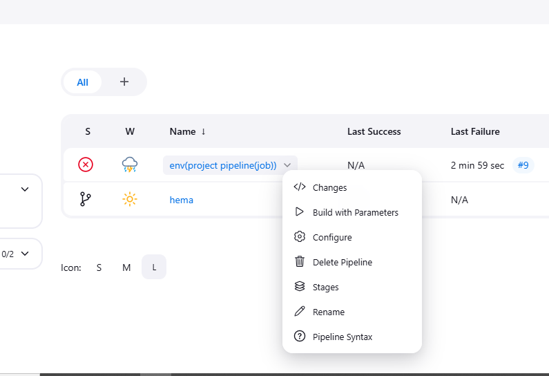

### Api

(api creation and testing on postman)[https://medium.com/@xiaolancara/using-aws-api-gateway-to-build-an-end-to-end-http-api-efd8fbd917c6]


### how to build one pipeline in different envirnments

* first you create some git hub repo 

* in that repo you want to create  config (dev.env,qa.env,prod.env), build.sh,Jenkinsfile,src(main.py)







```Jenkinsfile
pipeline {
    agent any
    parameters {
        // Parameter for selecting branch
        string(name: 'BRANCH_NAME', defaultValue: 'main', description: 'Branch to build')
        
        // Parameter for selecting environment
        choice(name: 'ENVIRONMENT', choices: ['dev', 'qa', 'prod'], description: 'Environment to deploy')
    }
    stages {
        stage('Checkout') {
            steps {
                echo "Checking out branch: ${params.BRANCH_NAME}"
                // Checkout the selected branch
                git branch: "${params.BRANCH_NAME}", url: 'https://github.com/hemachaitanya/hemachaitanya.git'
            }
        }
        stage('Deploy to Environment') {
            steps {
                sh 'chmod 777 build.sh'
                echo "Deploying to environment: ${params.ENVIRONMENT}"
                // Example command based on selected environment
                script {
                    if (params.ENVIRONMENT == 'dev') {
                        echo "Deploying to Development environment"
                        // Add dev-specific deployment steps here
                    } else if (params.ENVIRONMENT == 'qa') {
                        echo "Deploying to QA environment"
                        // Add QA-specific deployment steps here
                    } else if (params.ENVIRONMENT == 'prod') {
                        echo "Deploying to Production environment"
                        // Add prod-specific deployment steps here
                    }
                }
            }
            stage('working'){
                steps{
                    sh 'chmod +x build.sh'
                    sh 'pwd'
                }
            }
        }
        // Additional stages for build, test, or deploy if necessary
    }
}
```



* we are passing the parameters through pipeline in jenkinsfile , go to jenkins job and run the jobs required branches and required env

steps are mentioned below 

